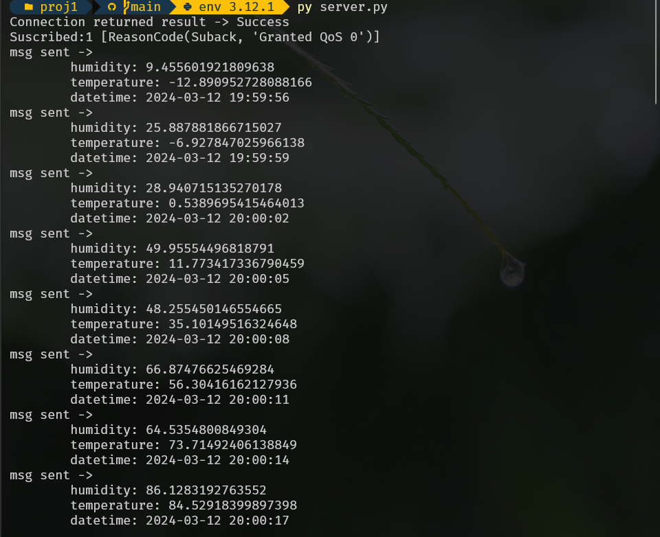
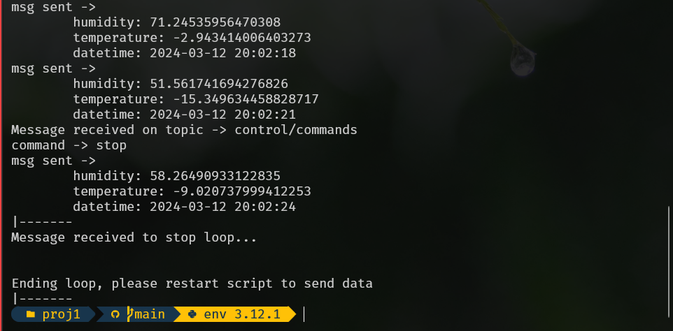
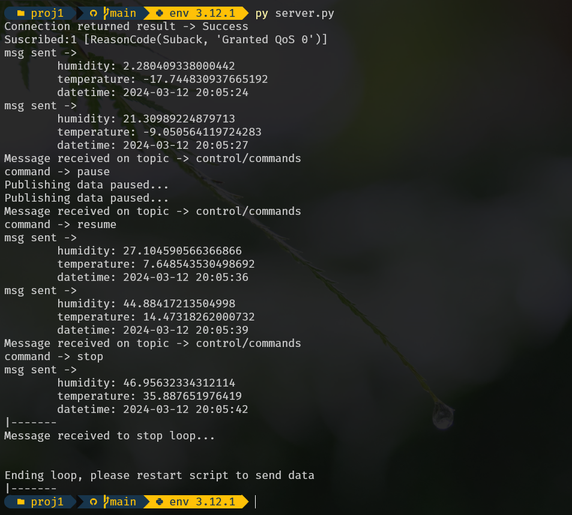
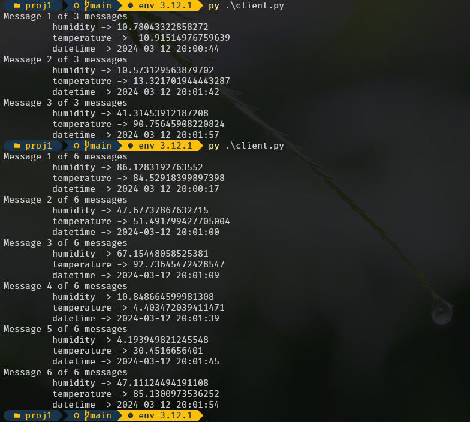
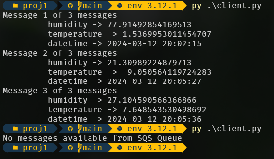

# Table of Contents
1. [Introduction](#introduction)
    1. [Implementation and Assumptions](#implementation-and-assumptions)
2. [Code](#code)
    2. [Server Code](#server-code)
    2. [Client Code](#client-code)
3. [Images](#images)
    3. [Server Images](#server-images)
    3. [Client Images](#client-images)


# Introduction

ECEA5348's first project is to get an understanding of using cloud tools
such as AWS to send messages to "Things." A lot of this project involves
the initial setup of an AWS, setting up a Thing, and sending it messages 
using the MQTT protocol through the Python libraries `paho` and 
reading the SQS messsages from `boto3`.

The data generated is from a pseudo temperature and humidity sensor. That 
data is sent from our "local device" to the AWS cloud where it is retained
in AWS for the default four days.

## Implementation and Assumptions

This being the first time working with AWS there was a lot of learning to 
get the system setup. Luckily, the AWS tutorials had great step-by-step
guides to getting a setup running on Windows.

The first step to making sure the setup would work was to install the 
`awdiotsdk` and the examples files from AWS and execute them and see them
working after the initial Thing setup.

From there, it was following directions on setting up the SQS and learning
howt to use `paho` and `boto3` to get started. Using `paho` had some challenges
at first due to the older guide. The MQTT standard is now on version five, 
therefore the older library would not work with a simple copy-paste.

It took a lot of searching and reading the documents to get `paho` to work,
even though the change was super simple. Thankfully, `paho`'s example
on GitHub and [Steve's Guide](http://www.steves-internet-guide.com/python-mqtt-client-changes/)
helped understand the differences from the class's links to what the latest
libraries required to get started.

Once the Python code ran fine, and everything was working on the AWS Console,
it was time to right the client code that would then consume the messages
from the SQS queue.

Once assumption here was that once the message was read, it was to be deleted
from the SQS queue, in other words, the data is consumed and assumed to be
properly used by the end user or application.

To ensure that the code is safe and nothing is exposed, the `dotenv` library 
is installed and used to hide locations of the private keys, access keys,
and endpoints of the AWS setup.

# Code

The code is split into two components, `server.py` and `client.py`. The code in
`server.py` establishes the connection to the AWS Thing through the endpoint
and publishes the humidity, temperature, and datetime data through the
"sensor/data" topic. 

The `on_message` function parses incoming data to tell the server to stop
sending data to and to gracefully exit the application. This is done through
the AWS Console through the MQTT Testing page. The `handle_command` helper
function slims down the code a bit and handles the `stop`, `pause`, and
`resume` commands that can be submitted through the "control/commands" topic.

The `client.py` script loops through the queued messages and continues to
run until all the messages are consumed.

## Server Code

```python
import paho.mqtt.client as paho
import json
import ssl
import time
import datetime
from dotenv import dotenv_values
import pseudoSensor

config = dotenv_values(".env")
connflag = False
run = True


# http://www.steves-internet-guide.com/python-mqtt-client-changes/
# MQTT version five is used, the above guide helps understand the code changes
# Needed to get this to work with the latest libraries
def on_connect(client, userdata, flags, reason_code, properties=None):
    global connflag
    connflag = True
    print("Connection returned result ->", str(reason_code))


def on_message(client, userdata, msg):
    payload = json.loads(msg.payload)
    print("Message received on topic ->", msg.topic)
    for key, value in payload.items():
        print(key, "->", value)

    # Handle the commands
    match msg.topic:
        case "control/commands":
            handle_command(payload)


def handle_command(payload: dict):
    """
    handle_command takes in the message payload and specifically looks
    for a "command" key to parse and handle from the "control/commands" topic

    Args:
        payload (dict): command payload from topic "control/commands"
    """
    global run
    global connflag
    match payload["command"]:
        case "stop":
            run = False
        case "pause":
            connflag = False
        case "resume":
            connflag = True
        case _:
            print("Error: unknown command", payload["command"])


def on_subscribe(client, obj, mid, reason_code_list, properties):
    print("Suscribed:" + str(mid) + " " + str(reason_code_list))


mqtt_client = paho.Client(
    paho.CallbackAPIVersion.VERSION2)

mqtt_client.on_connect = on_connect
mqtt_client.on_message = on_message
mqtt_client.on_subscribe = on_subscribe

mqtt_client.tls_set(
    ca_certs=config["CA_CERT"],
    certfile=config["CERT_FILE"],
    keyfile=config["PRIV_KEY"],
    cert_reqs=ssl.CERT_REQUIRED,
    tls_version=ssl.PROTOCOL_TLSv1_2,
    ciphers=None
)

mqtt_client.connect(
    host=config["AWSHOST"],
    port=int(config["AWSPORT"]),
    keepalive=60
)

ps = pseudoSensor.PseudoSensor()

# Subscribe to the contorl/commands topic which sends the stop command
# To end the MQTT loop
mqtt_client.subscribe("control/commands")

mqtt_client.loop_start()

while run:
    time.sleep(3)
    if connflag:
        hum, temp = ps.generate_value()
        now = datetime.datetime.now().strftime("%Y-%m-%d %H:%M:%S")
        data = {"humidity": hum, "temperature": temp, "datetime": now}

        mqtt_client.publish("sensor/data", json.dumps(data), qos=1)
        print("msg sent -> ")
        print("\thumidity:", hum)
        print("\ttemperature:", temp)
        print("\tdatetime:", now)
    else:
        print("Publishing data paused...")

# Thing has sent the command to stop, the above while loop is stopped
# So the MQTT client loop is stopped.
print("|-------")
print("Message received to stop loop...\n\n")
print("Ending loop, please restart script to send data")
print("|-------")
mqtt_client.loop_stop()
```
## Client Code

```python
import boto3
import json
from dotenv import dotenv_values

config = dotenv_values(".env")

sqs = boto3.client("sqs")

queue_url = config["SQS_QUEUE_URL"]

response = sqs.receive_message(
    QueueUrl=queue_url,
    MaxNumberOfMessages=10,
)


# Check if the response has any messages received
if "Messages" in response.keys():
    amt_messages = len(response["Messages"])
    for i, message in enumerate(response["Messages"]):
        body = json.loads(message["Body"])

        print("Message", i+1, "of", amt_messages, "messages")
        for key, value in body.items():
            print("\t", key, "->", value)

        sqs.delete_message(
            QueueUrl=queue_url,
            ReceiptHandle=message["ReceiptHandle"]
        )
else:
    print("No messages available from SQS Queue")
```
# Images
## Server Images

Server on startup, showing success message on connect and sending messages
immediately after startup:



Server closing:



Server with pause/resume/stop commands from "control/commands" topic:



## Client images

The image below shows the client receiving messages from the SQS client,
printing the messages, and then deleting them from the queue.



When there are no more messages, the client will report that too:


