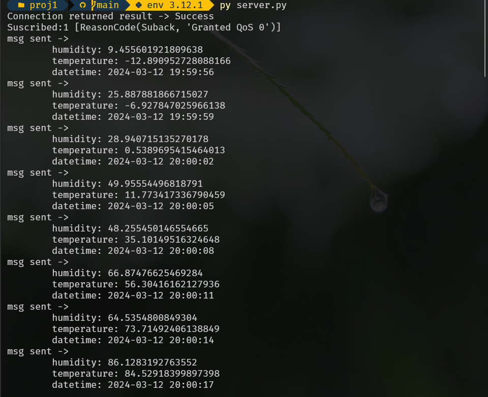
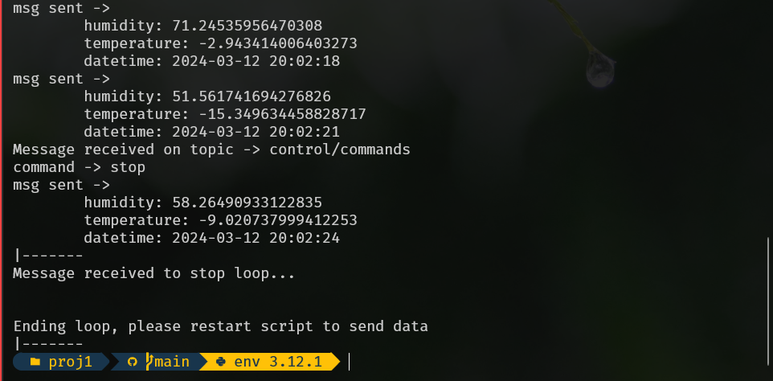
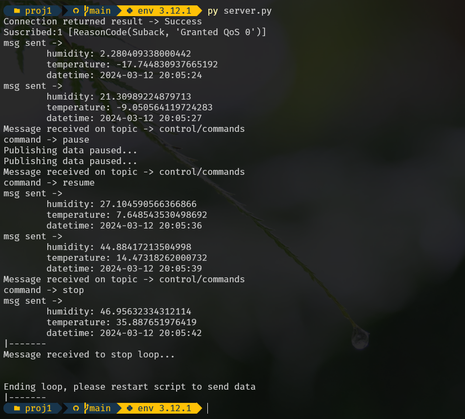
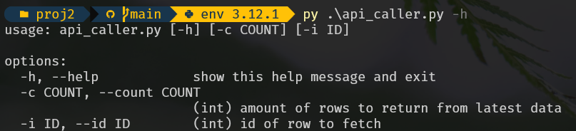
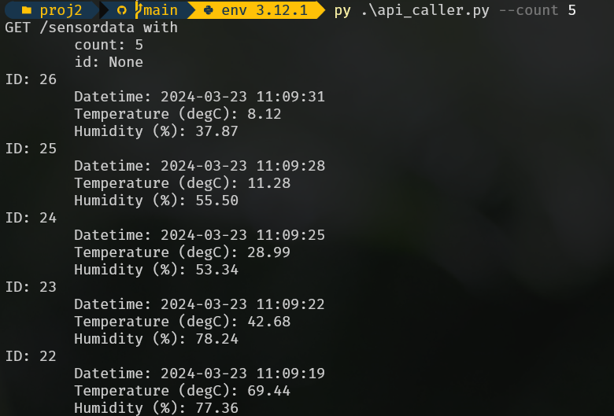

# Table of Contents
1. [Introduction](#introduction)
    1. [Implementation and Assumptions](#implementation-and-assumptions)
2. [Code](#code)
    2. [Lambda MySQL RDS Function](#lambda-mysql-rds-function)
    2. [Lambda API Gateway Handler](#lambda-api-gateway-handler)
    2. [Python REST API Caller](#python-rest-api-caller)
3. [Images](#images)
    3. [Server Images](#server-images)
    3. [API Client Images](#rest-api-client-images)


# Introduction

ECEA5348's second project is to take the insfrastructure built in the first
project and add Lambda code to take the project further. In this project the
goal is to use the AWS infrastructure to send the sensor data to a database
and build an API to get the new data.

# Implementation and Assumptions

This project had a lot of rough edges to it at the beginning. Lots of little
parts are added together to get the project working, ranging from the IoT Core
to the IAM role manager. Altogether, these were the systems that had to be
used to get this project finished:

1. IoT Core
1. AWS Lambda
1. SQS (although this was not used after the first project)
1. MySQL RDS
1. IAM Role Manager
1. Secrets Manager
1. VPC Endpoints
1. API Gateway

This time around, compared to the first project, the challenge was not
in programming, but learning how AWS worked. Some challenges at the beginning
with getting systems connected lead to an `Admin` role that allowed all access
to the tools to reduce the headache of learning all these systems.

Once the project started working, it started to make sense (especially thinking
about scaling) why these tools are in place and that the initial hurdle is
very much worth it when working on larger scale projects.

The most difficult part of this project was getting the Lambda functions to
properly communicate with the other services. Following the tutorials, the 
Lambda functions needed to be routed through Virtual Private Connections and
appropriate security policies to have access to other services. At first, the
Lambda functions could not connect to the Secrets Manager as the VPCs that
were being used did not have that service attached to them. These headaches
caused the most trouble, as the code used was from the tutorials but those
other steps were easier to miss or to not include in a tutorial.

Once the Secret Manager and RDS connection issues were fixed the rest became
easy as the lessons learned from the first two were easy to carry to the 
API Gateway specification of the project.

# Code

Two Lambda functions and a simple command line Python API caller were written
as part of the project specifications to upload and receive data.

## Lambda MySQL RDS Function

The first Lambda function takes the data from the sensor and adds it to the
database made with MySQL. Because the data format is easy, the addition process
is not lengthy and not a lot of error checking is performed. At this point the
data is assumed to be correct.

```python
import logging
import pymysql
import json
import boto3
import os
from botocore.exceptions import ClientError
import sys

# Code used from tutorial to insert data into an AWS RDS db
# https://docs.aws.amazon.com/AmazonRDS/latest/UserGuide/rds-lambda-tutorial.html

# Use this code snippet in your app.
# If you need more information about configurations
# or implementing the sample code, visit the AWS docs:
# https://aws.amazon.com/developer/language/python/


def get_secret():

    secret_name = "ecea5348/secrets"
    region_name = "us-east-1"

    # Create a Secrets Manager client
    session = boto3.session.Session()
    client = session.client(
        service_name='secretsmanager',
        region_name=region_name
    )
    print("session made")

    try:
        print("getting secret values")
        get_secret_value_response = client.get_secret_value(
            SecretId=secret_name
        )
        print("secret values got")
    except ClientError as e:
        # For a list of exceptions thrown, see
        # https://docs.aws.amazon.com/secretsmanager/latest/apireference/API_GetSecretValue.html
        raise e

    secret = get_secret_value_response['SecretString']
    return secret


secret = json.loads(get_secret())

db_username = secret.get('username')
db_password = secret.get('password')
db_name = secret.get('dbname')
host = os.environ.get("RDSHOST")
table = "SensorData"


logger = logging.getLogger()
logger.setLevel(logging.INFO)


# Create the database connection outside of handler events to allow
# connections to be re-used by subsequent function invocations.

try:
    conn = pymysql.connect(
        host=host,
        user=db_username,
        passwd=db_password,
        db=db_name,
        connect_timeout=5
    )

except pymysql.MySQLError as e:
    logger.error(
        "ERROR: Unexpected error: Could not connect to MySQL instance.")
    logger.error(e)
    sys.exit(1)


logger.info("SUCCESS: Connection to RDS for MySQL instance succeeded.")


def lambda_handler(event, context):
    """
    Creates a database if one does not exist and adds pseudo sensor data to it.
    """

    datetime = event['datetime']
    temperature = float(event['temperature'])
    humidity = float(event['humidity'])

    insert_data_str = f"""
    INSERT INTO {table} (datetime, temperature_degC, humidity_pcent)
    values (%s, %s, %s)
    """

    create_table_str = f"""
        CREATE TABLE IF NOT EXISTS {table} (
        id int AUTO_INCREMENT,
        datetime varchar(255),
        temperature_degC float,
        humidity_pcent float,
        primary key (id)
    )
    """

    with conn.cursor() as cur:
        cur.execute(create_table_str)
        cur.execute(insert_data_str, (datetime, temperature, humidity))

    conn.commit()

    return "Added item to RDS for MySQL table"
```
## Lambda API Gateway Handler

The API calls require access to the database, therefore the Secrets Manager
boilerplate code is reused to open the connection. The user, when callin the 
API, is able to query with two parameters, `count` and `id`. Additional queries
can be developed where the main challenge is to add to the `WHERE` clause 
creation and building the query correctly.

```python
import json
import os
import pymysql
import sys
import boto3
import logging
from botocore.exceptions import ClientError


def get_secret():

    secret_name = "ecea5348/secrets"
    region_name = "us-east-1"

    # Create a Secrets Manager client
    session = boto3.session.Session()
    client = session.client(
        service_name='secretsmanager',
        region_name=region_name
    )
    print("session made")

    try:
        print("getting secret values")
        get_secret_value_response = client.get_secret_value(
            SecretId=secret_name
        )
        print("secret values got")
    except ClientError as e:
        # For a list of exceptions thrown, see
        # https://docs.aws.amazon.com/secretsmanager/latest/apireference/API_GetSecretValue.html
        raise e

    secret = get_secret_value_response['SecretString']
    return secret


secret = json.loads(get_secret())

db_username = secret.get('username')
db_password = secret.get('password')
db_name = secret.get('dbname')
host = os.environ.get("RDSHOST")
table = "SensorData"

logger = logging.getLogger()
logger.setLevel(logging.INFO)


# Create the database connection outside of handler events to allow
# connections to be re-used by subsequent function invocations.

try:
    conn = pymysql.connect(
        host=host,
        user=db_username,
        passwd=db_password,
        db=db_name,
        connect_timeout=5
    )

except pymysql.MySQLError as e:
    logger.error(
        "ERROR: Unexpected error: Could not connect to MySQL instance.")
    logger.error(e)
    sys.exit(1)


logger.info("SUCCESS: Connection to RDS for MySQL instance succeeded.")


def lambda_handler(event, context):
    """
    Handles the API for this course project.
    Returns data from the sensor MySQL database.

    Query parameters:
    count (int): returns count number of entries from database, if count is
    greater than the amount of data available, returns max amount
    """

    condition = "WHERE"

    # Count is the amount of data to retrieve from the latest set of data
    try:
        count = int(event["queryStringParameters"]["count"])
    except Exception as e:
        logger.info("Error parsing query parameter count: setting to default 1")
        logger.info(e)
        count = 1

    # Allow the user to also filter by a particular ID
    try:
        id = int(event["queryStringParameters"]["id"])
        condition += f" id={id}"
    except Exception as e:
        logger.info("Error parsing query parameter id")
        logger.info(e)
        id = None
        condition += ""

    get_data = f"""
        SELECT * FROM {table}
    """
    order_by = "ORDER BY id DESC"
    limit = f"LIMIT {count}"

    if condition == "WHERE":
        full_query = get_data + " " + order_by + " " + limit
    else:
        full_query = get_data + " " + condition + " " + order_by + " " + limit

    with conn.cursor() as cur:
        cur.execute(full_query)
        rows = cur.fetchall()

    content = {}
    payload = []

    # Make the rows list[list] into a dictionary
    for row in rows:
        content = {"id": row[0], "datetime": row[1],
                   "temperature_degC": row[2], "humidity_pcent": row[3]}
        payload.append(content)

    return {
        "statusCode": 200,
        "headers": {
            "Content-Type": "*/*"
        },
        "body": json.dumps(payload),
    }
```
## Python REST API Caller

Using Python and an external module, `requests`, a small Command Line tool is
made that can call the deployed API and retrieve data from the MySQL database.

The `argparse` library makes CLI tool development simple, and adding the query
parameters (`count`, `id`) as options was easy to do and added a nice layer
of interactivity when calling the API.

```python
import requests
import argparse
from dotenv import dotenv_values

config = dotenv_values(".env")
parser = argparse.ArgumentParser()
parser.add_argument(
    "-c", "--count", help="(int) amount of rows to return from latest data",
    type=int, default=1)
parser.add_argument(
    "-i", "--id", help="(int) id of row to fetch",
    type=int, default=None)

args = parser.parse_args()
api_endpoint = "/sensordata"
api_url = config["API_ROOT"] + api_endpoint

print(f"GET {api_endpoint} with")
for arg, val in vars(args).items():
    print(f"\t{arg}: {val}")


response = requests.get(api_url, params={"count": args.count, "id": args.id})
response_json = response.json()
if response_json is not {}:
    for content in response_json:
        print("ID:", content.get("id"))
        print("\tDatetime:", content.get("datetime"))
        print(f"\tTemperature (degC): {content.get("temperature_degC"):.2f}")
        print(f"\tHumidity (%): {content.get("humidity_pcent"):.2f}")
else:
    print("Empty result")
```

# Images 
## Server Images

Server on startup, showing success message on connect and sending messages
immediately after startup:



Server closing:



Server with pause/resume/stop commands from "control/commands" topic:



## REST API Client Images

Since the client is using `argparse` the user can use the `-h` option to show
the available commands.



Using the `count` parameter, the user can request a number of records to fetch.


